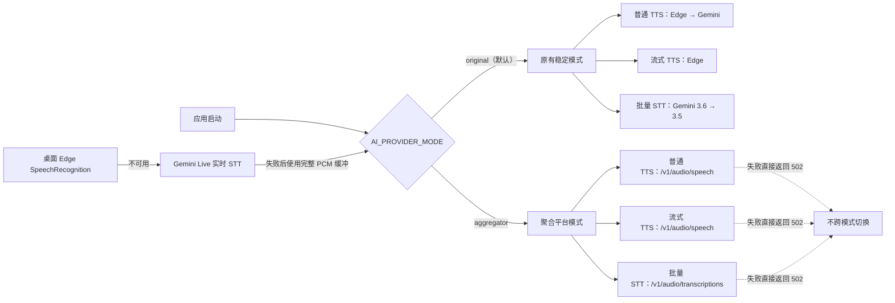

# 系统架构设计（启动时固定提供方模式）

## 1. 设计结论

应用通过 `AI_PROVIDER_MODE` 在进程启动时选择一种后端语音提供方模式：

| 模式 | 普通 TTS | 流式 TTS | 批量/缓冲 STT |
|---|---|---|---|
| `original`（默认） | Microsoft Edge → Google Gemini SDK | Microsoft Edge | Gemini SDK：`3.6-flash` → `3.5-flash` |
| `aggregator` | LLM 聚合平台 | LLM 聚合平台 | LLM 聚合平台 |

两种模式互斥。聚合平台请求失败不会自动切换到 Edge 或 Gemini，原有模式失败也不会切换到聚合平台。`original` 是默认值，用于优先保持原有稳定性。

实时 STT 是例外：聚合平台目前没有实时增量转录协议，因此浏览器仍优先使用 Edge `SpeechRecognition`，后端仍使用 Gemini Live。Gemini Live 失败后，完整 PCM 缓冲才交给启动时选定的批量 STT 模式。

## 2. 整体架构图

## 3. 设计原则

1. **启动时确定**：模式在配置加载时解析并锁定，修改环境变量后必须重启应用。
2. **默认稳定**：未配置时选择 `original`，继续使用原有 Edge/Gemini 逻辑。
3. **禁止跨模式熔断**：请求级异常只在当前模式内处理，绝不改变进程提供方选择。
4. **保留原有内部降级**：`original` 模式中的 Edge → Gemini 和 Gemini 主备模型属于原有稳定链，不是聚合平台熔断。
5. **启动校验**：选择 `aggregator` 时，缺少平台 URL 或 Key 会阻止应用成功启动。
6. **真实格式识别**：聚合平台音频仍按文件魔数识别 WAV/MP3，避免错误的上游 `Content-Type`。
